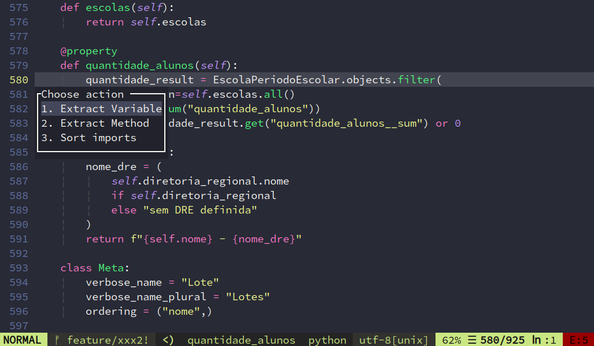
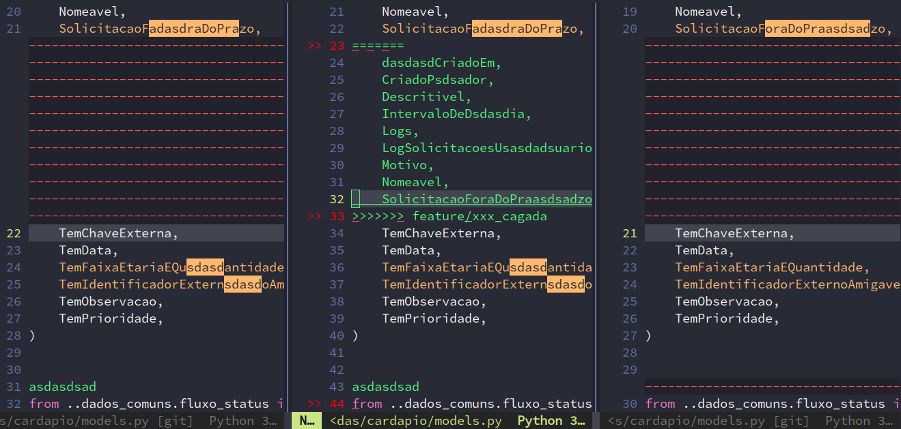
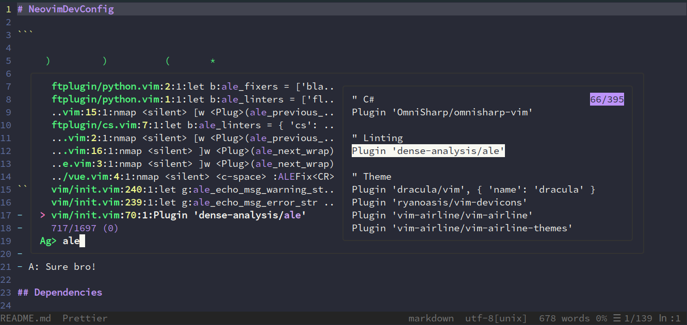
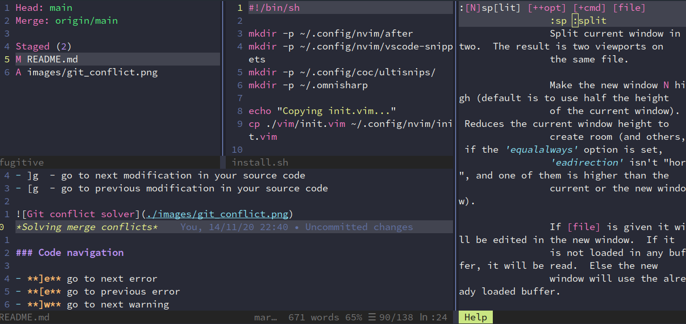
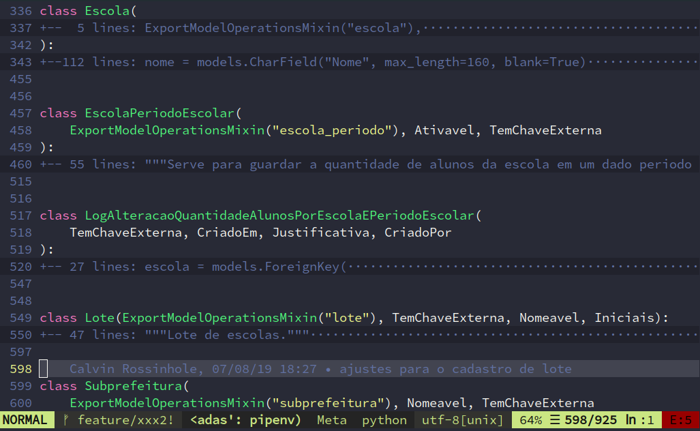

# Neovim Developer Configuration

```
 ███▄    █ ▓█████  ▒█████   ██▒   █▓ ██▓ ███▄ ▄███▓
 ██ ▀█   █ ▓█   ▀ ▒██▒  ██▒▓██░   █▒▓██▒▓██▒▀█▀ ██▒
▓██  ▀█ ██▒▒███   ▒██░  ██▒ ▓██  █▒░▒██▒▓██    ▓██░
▓██▒  ▐▌██▒▒▓█  ▄ ▒██   ██░  ▒██ █░░░██░▒██    ▒██
▒██░   ▓██░░▒████▒░ ████▓▒░   ▒▀█░  ░██░▒██▒   ░██▒
░ ▒░   ▒ ▒ ░░ ▒░ ░░ ▒░▒░▒░    ░ ▐░  ░▓  ░ ▒░   ░  ░
░ ░░   ░ ▒░ ░ ░  ░  ░ ▒ ▒░    ░ ░░   ▒ ░░  ░      ░
   ░   ░ ░    ░   ░ ░ ░ ▒       ░░   ▒ ░░      ░
         ░    ░  ░    ░ ░        ░   ░         ░
                                ░
```

- Q: What is it?
- A: My personal configuration for NeoVIM

- Q: It's better than a paid IDE?
- A: Sure bro!

## Dependencies

### Mandatory

- [NeoVIM >= 0.5](https://launchpad.net/~neovim-ppa/+archive/ubuntu/stable)
- Nodejs >= 12. Please prefer [NVM](https://github.com/nvm-sh/nvm)
- Python >2.7   Please prefer 3.5+

### Optional

- [Ag - The silver archer](https://github.com/ggreer/the_silver_searcher)
- [Ctags](http://ctags.sourceforge.net/)
- [Figlet](http://www.figlet.org/)
  - On windows try: ``npm install -g figlet-cli``
- [Jedi](https://github.com/davidhalter/jedi)
- [Virtualenv](https://github.com/pypa/virtualenv)

## Leader key: '\\'

## Features

- Fuzzy find files: \<Control-p>
- Find by text content (Must have Ag command)
- Show who made last modification like Gitlens from vscode
- Align text using a token as a reference
- Markdown preview
- Snippets for many languages
- Tagbar: view your variables and classes on the right side \<Control-tt>
- Comments
- Git integration for commits, conflicts, diffs, etc.
- ASCII art and ASCII diagrams
- Toggle words to it opposite: on-off, true-false, etc
- Intuitive navigation using [ and ]
- Intellisense for python, js, c#, vuejs, django, vimfiles, json, css, html, Dockerfile, yaml, sql and more
- Spelling check
- Refactoring
- Renaming
- Smart suggestions

## Shortcuts

### Most useful shortcuts

- **\<Control-space\>** - display code actions like refactoring and fix errors
- **\<Control-p\>** - quickly find file
- **\<Leader\>l**  - code indenting
- **:Ag** - fuzzy find anything
- **K/J**  - move a code block up/down
- **\<Leader\>~**  - swap a word to it opposite
- **[g and ]g** - go to prev/next git modification

|  |
| :--:                                     |
| *Control + space calls code action!*     |

### Git

- **\<Leader\>gs**  - git status
- **\<Leader\>gc**  - git commit (type "commit" to use [Conventional Commits](https://www.conventionalcommits.org/en/v1.0.0/))
- **\<Leader\>gca**  - git commit --ammend
- **\<Leader\>gd**  - git diff(useful for merge conflicts)
- **\<Leader\>gl**  - accepts diff from right
- **\<Leader\>gh**  - accepts diff from left
- **\<Leader\>gv**  - Show file history
- **\<Leader\>gg**  - preview git modification
- **\<Leader\>gu**  - undo git modification
- **\<Leader\>gb**  - browse code in repository
- **\<Leader\>gr**  - revert uncommited file to last commit state
- **\<Leader\>gr!**  - revert **all** uncommited file to last commit state
- **]g**  - go to next modification in your source code
- **[g**  - go to previous modification in your source code

|  |
| :--:                                              |
| *Solving merge conflicts*                         |

### Code navigation

- **]e** - go to next error
- **[e** - go to previous error
- **]w** - go to next warning
- **[w** - go to previous warning
- **]s** - go to next spelling error
- **[s** - go to previous spelling error
- **]c** - go to next git conflict
- **[c** - go to previous git conflict
- **]z** - go to next folding
- **[z** - go to previous folding
- **]'** - go to next mark
- **['** - go to previous mark
- **]g** - go to next git modification
- **[g** - go to previous git modification
- **gd** - go do definition
- **:Ag** - Find anything with AG command

|  |
| :--:                                         |
| *Ag find anything!*                          |

### Window and tab navigation

- **\<Control-Right\>** - go to right window
- **\<Control-Left\>** - go to left window
- **\<Control-Up\>** - go to up window
- **\<Control-Down\>** - go to down window
- **\<Control-j\>** - go to bottom window
- **\<Control-h\>** - go to left window
- **\<Control-k\>** - go to up window
- **\<Control-l\>** - go to right window
- **\<Leader\>1** - go to first tab
- **\<Leader\>2** - go to second tab and so on...
- **\<Leader\>>** - vertical resize +
- **\<Leader\><** - vertical resize -
- **\<Leader\>+** - horizontal resize +
- **\<Leader\>-** - horizontal resize -
- **\<Leader\>=** - all splits equal

|  |
| :--:                                         |
| *Easy navigation on window splits*           |

### Folding

Assuming that your code is well indented, you can quickly hide and show methods/classes

- **zo/zc** - open/close fold
- **zk/zj** - to go up/down in folds
- **z1** - set foldlevel = 0
- **z2** - set foldlevel = 1
- **zn** - set foldlevel = n-1

|  |
| :--:                             |
| *Folding example using z1 key*   |
